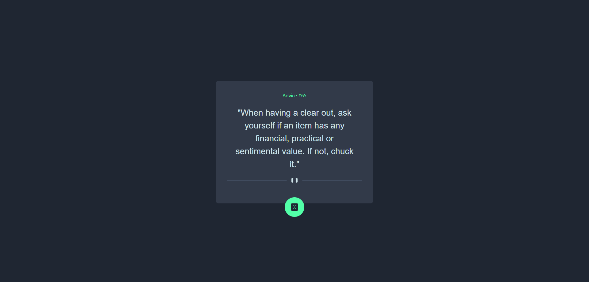
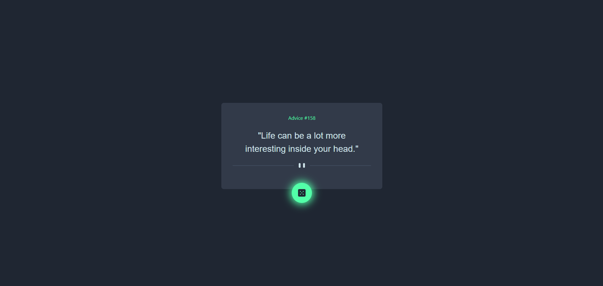
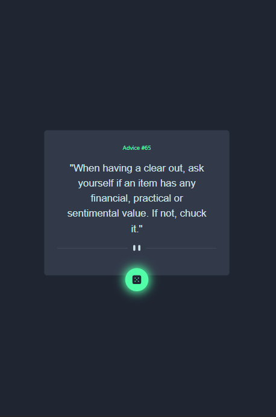

# Frontend Mentor - Advice generator app solution

This is a solution to the [Advice generator app challenge on Frontend Mentor](https://www.frontendmentor.io/challenges/advice-generator-app-QdUG-13db). Frontend Mentor challenges help you improve your coding skills by building realistic projects.

## Table of contents

- [Overview](#overview)
  - [The challenge](#the-challenge)
  - [Screenshot](#screenshot)
  - [Links](#links)
- [My process](#my-process)
  - [Built with](#built-with)
  - [Useful resources](#useful-resources)
- [Author](#author)

## Overview

### The challenge

Users should be able to:

- View the optimal layout for the app depending on their device's screen size
- See hover states for all interactive elements on the page
- Generate a new piece of advice by clicking the dice icon

### Screenshot
#### Desktop

#### Desktop - Hover

#### Mobile

### Links

- Solution URL : [Solution](https://github.com/shavindaL/advice-generator-app)
- Live Site URL : [Live site](https://advice-generator-i1oeqyus2-shavindal.vercel.app/)

## My process

### Built with

- [Tailwind CSS](https://tailwindcss.com/) - CSS Framework
- [React](https://reactjs.org/) - JS library
- [Next.js](https://nextjs.org/) - React framework

### Useful resources

- [Tailwind Documentation](https://tailwindcss.com/docs/installation)
- [Next.js Documentation](https://nextjs.org/docs)

## Author

- Frontend Mentor - [@shavindaL](https://www.frontendmentor.io/profile/shavindaL)

